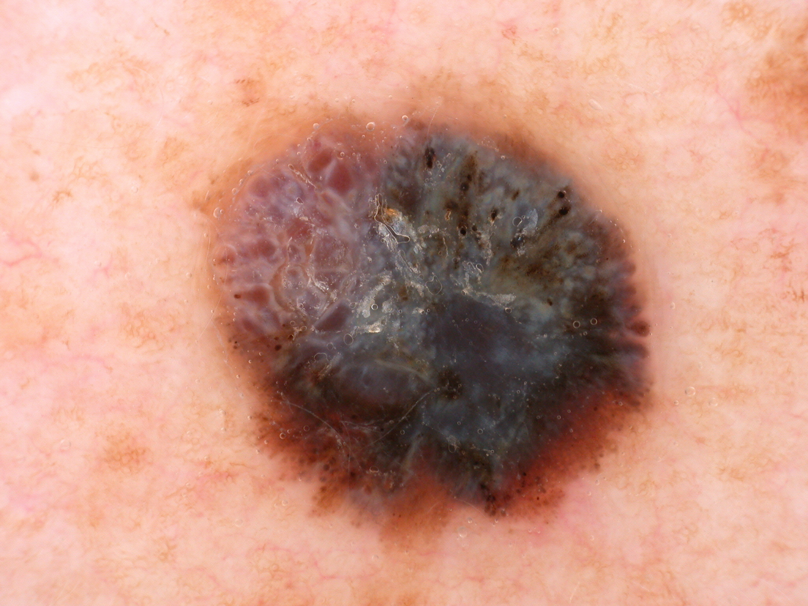
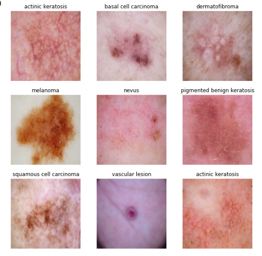
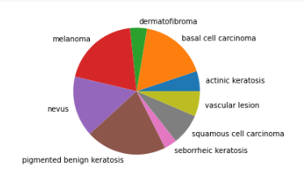
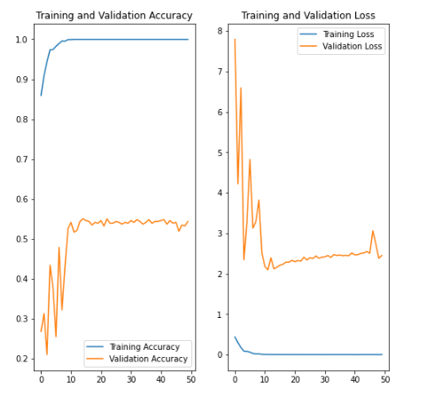
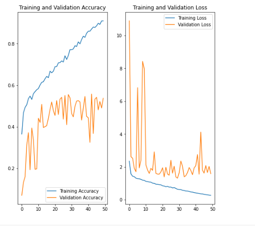
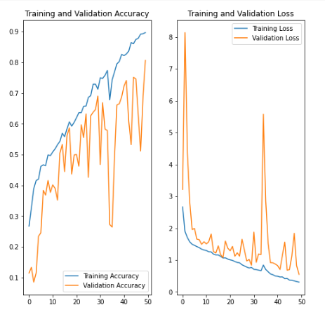

# Melanoma Detection Model 
> Melanoma is a type of cancer that can be deadly if not detected early. It accounts for 75% of skin cancer deaths.  

## Table of Contents
* [Objective](#Objective)
* [Data Exploration](#Data_Exploration)
* [MultiColinearity](#Multicolinearity)
* [Model Estimate](#Model_Estimate)
* [Conclusion](#Conclusion)

<!-- You can include any other section that is pertinent to your problem -->

## Objective
- To build a CNN based model which can accurately detect melanoma
- Model shall be used by dermatologists to alert them about the presence of melanoma and reduce the manual effort needed in diagnosis.
<!-- You don't have to answer all the questions - just the ones relevant to your project. -->

## Data_Exploration
-  The dataset consists of 2357 images of malignant and benign oncological diseases, which were formed from the International Skin Imaging Collaboration (ISIC).

### The data set contains the following diseases:
* Actinic keratosis
* Basal cell carcinoma
* Dermatofibroma
* Melanoma
* Nevus
* Pigmented benign keratosis
* Seborrheic keratosis
* Squamous cell carcinoma
* Vascular lesion

## Data Imbalance
- **Class Distribution:**
>By calculating the % of each class in the training dataset, we can see that "Seborrheic keratosis" has least numbers, followed by "dermatofibroma", "actinic >keratosis", "vasular lesion","squamous cell carcinoma", "nevus", "basal cell carcinoma", "melanoma" and "pigmented benign keratosis".

**Class Domination:**
>Four classes namely Pigmented Benign keratosis, Melanoma, Basal Cell carcinoma and Nevus occupy nearly 72.9% of the training dataset

- actinic keratosis 		    : 5.13
- basal cell carcinoma 		    : 17.24
- dermatofibroma 		        : 4.30
- melanoma 			            : 19.64
- nevus 				        : 15.46
- pigmented benign keratosis    : 20.65
- seborrheic keratosis 		    : 3.24
- squamous cell carcinoma 	    : 7.92
- vascular lesion 		        : 6.42

## Model_Estimate
- Initially the model is fit with training dataset (80%,20% - split) without Dropout layers and Image Augmentation.
    - We can see that this model has very high training accuracy (100%) due to overfitting
    - The validation accuracy is less than 55% and test accuracy is only 35%.
    - 
- Then we apply the Dropout layer and Image Augmentation
    - We can see that model overfitting is much avoided in the early loops but as the epoches increases the model starts overfitting.
    - The validation accuracy is <55% and test accuracy is slightly improved to 41%.
    - 
- But still the model predictions are lagging due to data imbalance. Hence we apply data augmentation technique.
    - With data augmentation dataset, we can see that the model predictions are much improved.
    - - 

## Conclusion
   -   From the above models and prediction we can see that 
        - With data augmentation and proper selection of Network layers(dropouts Batch Normalization, Image Augmentation)
        - The model can be effectively utilized to detect MELANOMA disease from the Images 
 
<!-- You don't have to answer all the questions - just the ones relevant to your project. -->
